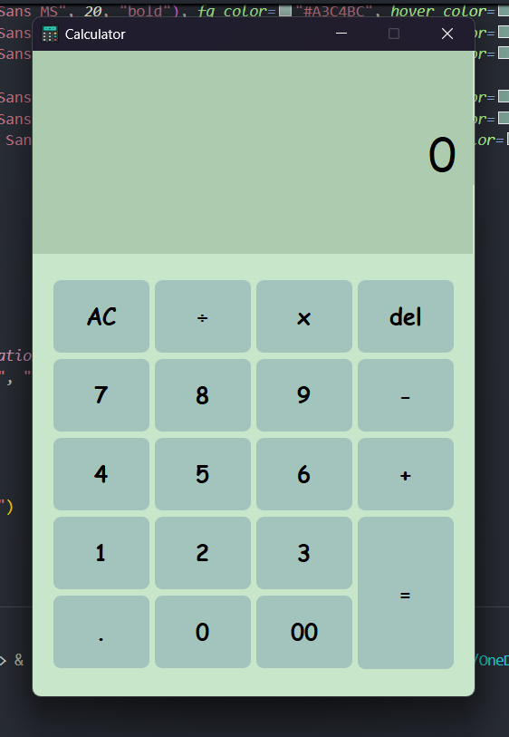

💚 Aesthetic Calculator using Python & CustomTkinter

A fully functional and modern-looking calculator built with PYTHON and CustomTkinter, styled with a soft green matcha-like aesthetic. Supports basic arithmetic operations, clear, delete, and error handling.

 <!-- Preview Calculator UI -->

---

📦 Features

- CustomTkinter GUI with modern look
- Supports: `+`, `-`, `×`, `÷`, decimals, double zero
- Hover effect with darker green shade (`#7A9F95`)
- Error handling:
  - Syntax errors
  - Division by zero
- Delete single character or clear input
- Responsive input display
- Clean and beginner-friendly code structure

---

🛠️ Technologies Used

- Python
- CustomTkinter
- (Optional) `tkinter` base
- Icons/images (custom `.ico` file)

---
